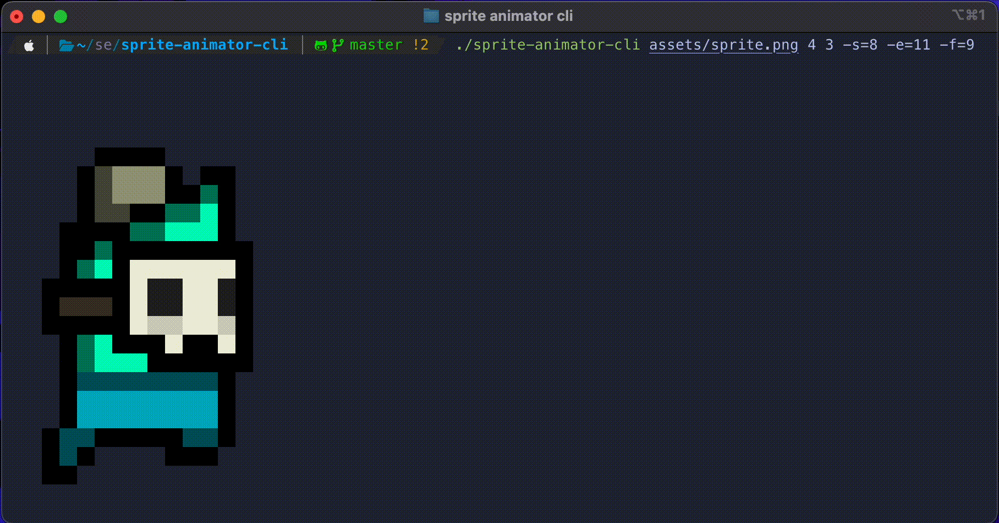

# sprite-animator-cli

animate the sprites in terminal

```shell
$ sprite-animator-cli assets/sprite.png 4 3 --start=8 --end=11 --fps=9
```



```
Usage:
  sprite-animator-cli <file> <col> <row> [flags]

Flags:
  -e, --end uint     animation end index
  -f, --fps int      frame per second (default -1)
  -h, --help         help for sprite-animator-cli
  -s, --start uint   animation start index
```
